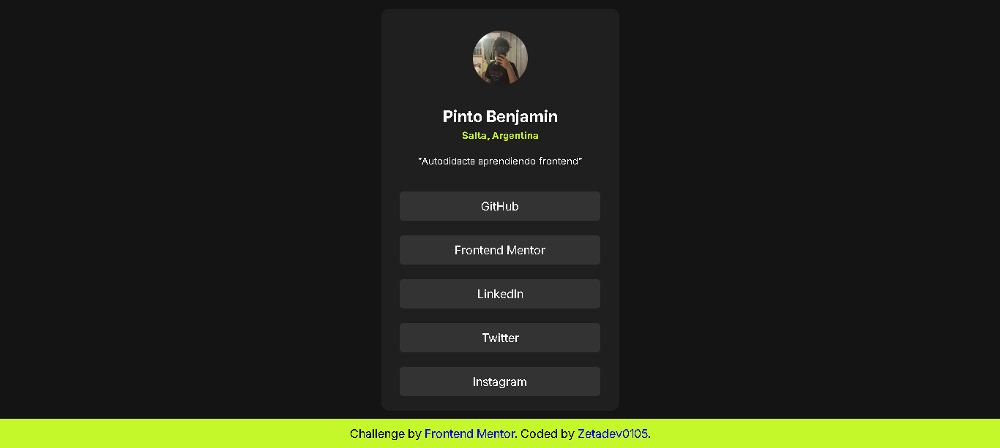
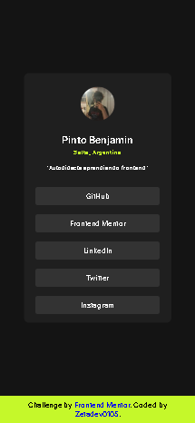

# Frontend Mentor - Social Links Profile Solution

This is my solution to the [Social Links Profile challenge](https://www.frontendmentor.io/challenges/social-links-profile-UG32l9m6dQ) on Frontend Mentor. These challenges help me improve my frontend development skills by building realistic projects.

## Table of Contents

* [Overview](#overview)

  * [The Challenge](#the-challenge)
  * [Screenshot](#screenshot)
  * [Links](#links)
  * [Built With](#built-with)
  * [What I Learned](#what-i-learned)
  * [Continued Development](#continued-development)
  * [AI Collaboration](#ai-collaboration)

### The Challenge

Users should be able to:

* View hover and active states for all interactive elements on the page.

### Screenshot

### Links

* **Repository:** https://github.com/Zetadev0105/Social_links_profile
* **Live Site:** https://zetadev0105.github.io/Social_links_profile/

### Built With

* Semantic HTML5
* CSS
* Flexbox
* BEM methodology
* CSS pseudo-class (`:active`)

### What I Learned

During this project, I reinforced some important frontend concepts.

* I learned how to distribute elements asymmetrically by using `margin-top` to create more balanced layouts.
* I learned how to use `target="_blank"` to open external links in a new browser tab.

Working on this challenge also helped me become more comfortable building layouts from a design and writing cleaner HTML and CSS.

### Continued Development

In future projects, I want to continue practicing **Flexbox** until I can use it confidently in more complex layouts. My goal is to understand it well enough to build responsive interfaces more efficiently.

### AI Collaboration

I used **ChatGPT** as a learning assistant throughout this project.

It helped me:

* Understand frontend concepts, such as `target="_blank"`.
* Resolve questions when I got stuck.
* Learn the reasoning behind different HTML and CSS techniques instead of simply copying solutions.

